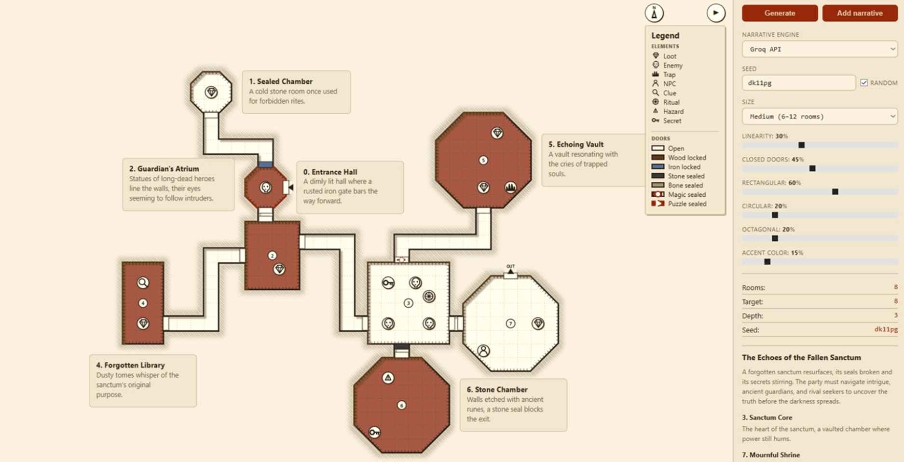

# DungeonBuilder

Procedural dungeon map generator with a small FastAPI backend and a Vite/TypeScript SVG frontend.

It generates dungeon layouts from a seed, renders rooms/corridors/doors/entrance/exit, and can add AI-generated room narratives as map labels or side-panel notes.

## Live test

Currently deployed here: [http://46.225.185.220:8080](http://46.225.185.220:8080)

## Features

* Seeded dungeon generation
* Small / medium / large map sizes
* Adjustable dungeon linearity
* Room shape mix: rectangular, circular, octagonal
* Accent-room probability
* SVG map rendering
* Pan and zoom support
* Doors, corridors, entrance and exit markers
* Optional narrative generation
* Narrative providers:

  * Local Ollama
  * Groq API
* Adaptive map labels with side-panel fallback when labels do not fit

## Project structure

```txt
DungeonBuilder/
  backend/          FastAPI dungeon generator + narrative API
  frontend/         Vite/TypeScript SVG UI
  docker-compose.yml
  .env
```

## API

Backend health check:

```txt
GET /health
```

Generate dungeon:

```txt
POST /api/dungeon/generate
```

Generate dungeon narrative:

```txt
POST /api/dungeon/narrate
```

Example request:

```json
{
  "size": "medium",
  "symmetryBreak": 30,
  "rectPct": 60,
  "circlePct": 20,
  "octagonPct": 20,
  "accentPct": 15,
  "llmProvider": "api"
}
```

## Local setup

### Backend

```bash
cd backend
python -m venv .venv
source .venv/bin/activate
pip install -r requirements.txt
uvicorn app.main:app --host 0.0.0.0 --port 8088
```

On Windows:

```bash
cd backend
python -m venv .venv
.venv\Scripts\activate
pip install -r requirements.txt
uvicorn app.main:app --host 0.0.0.0 --port 8088
```

### Frontend

```bash
cd frontend
npm install
npm run dev
```

Default local frontend:

```txt
http://localhost:5174
```

## Environment

Create `.env` in the project root:

```env
GROQ_API_KEY=
GROQ_MODEL=llama-3.3-70b-versatile

OLLAMA_BASE_URL=http://host.docker.internal:11434
OLLAMA_MODEL=gemma4:12b

BACKEND_CORS_ORIGINS=http://46.225.185.220
```

For Groq narrative generation, set `GROQ_API_KEY`.

For local Ollama narrative generation, make sure Ollama is running and the selected model is available.

## Docker deployment

Build and start:

```bash
docker compose up -d --build
```

Check containers:

```bash
docker compose ps
```

Check backend through Nginx:

```bash
curl http://127.0.0.1/health
```

Update deployment:

```bash
git pull
docker compose up -d --build
docker image prune -f
```

## VPS notes

The app is deployed as a Docker Compose stack:

* `frontend` serves the built Vite app through Nginx
* `backend` runs FastAPI on port `8088`
* Nginx proxies `/api/*` requests to the backend
* Public access is exposed through port `80` or optional fallback port `8080`

If port `80` is already used, either stop the old service/container or map the frontend as:

```yaml
ports:
  - "8080:80"
```


## Current status

The project is usable as a browser-based dungeon generator and narrative helper.

Main tested flow:

1. Open the deployed URL
2. Generate a dungeon
3. Adjust size / room-shape probabilities / linearity / accent chance
4. Add narrative
5. Review room labels on the map or in the side panel
